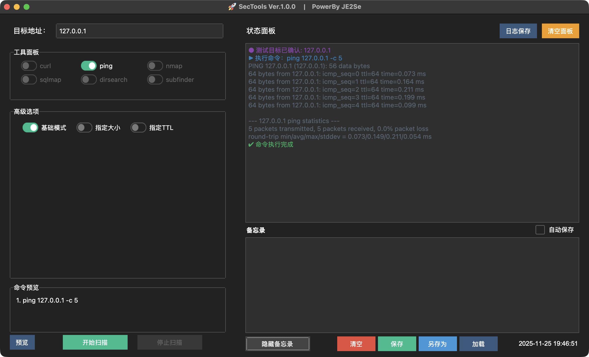
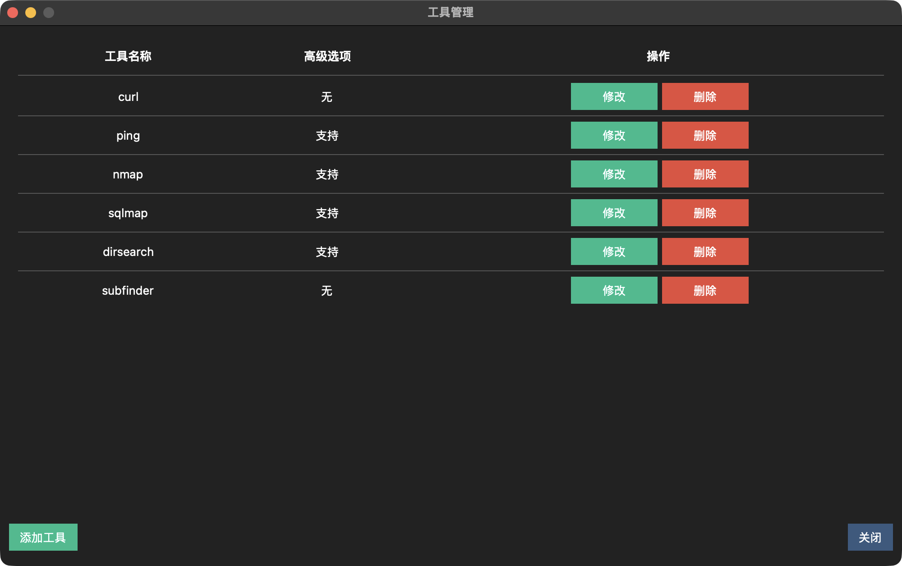
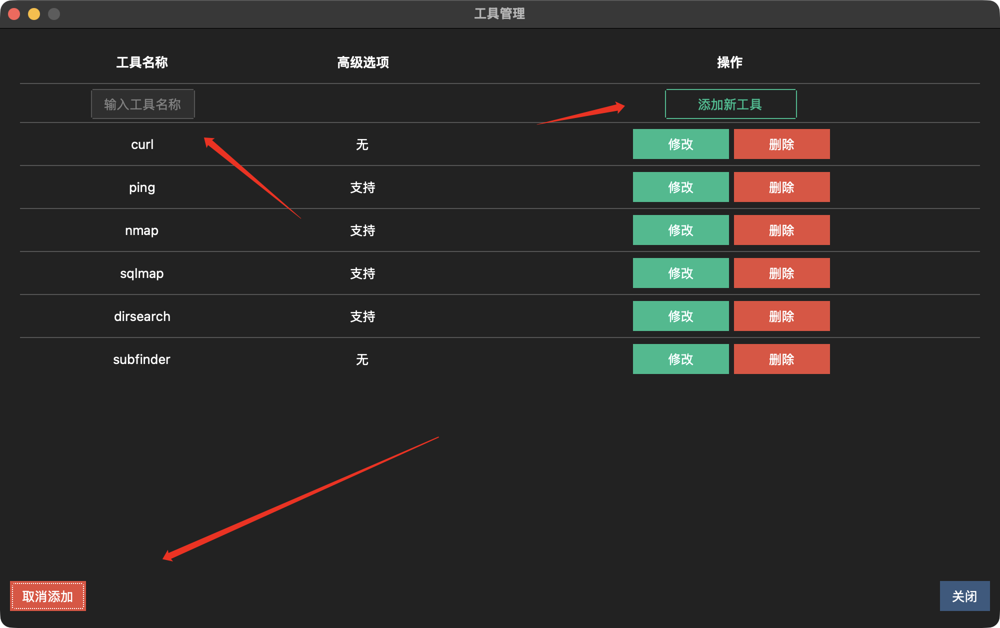
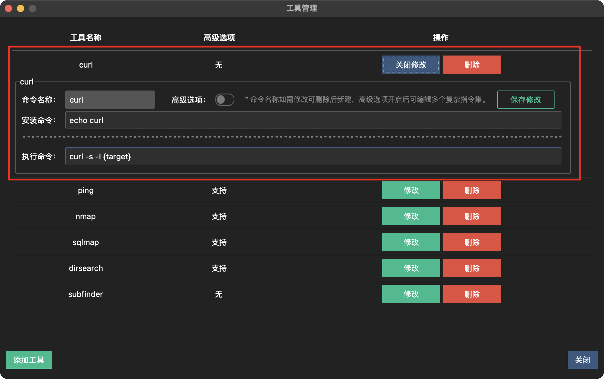
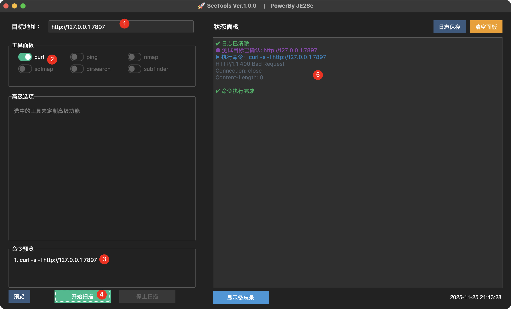
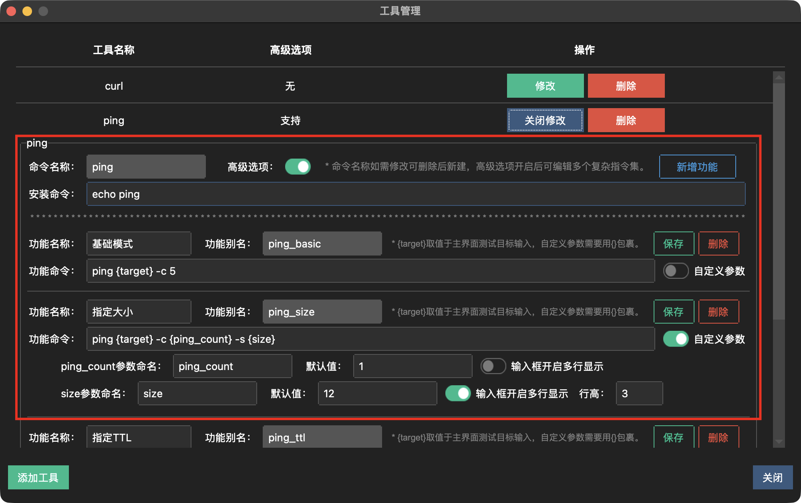
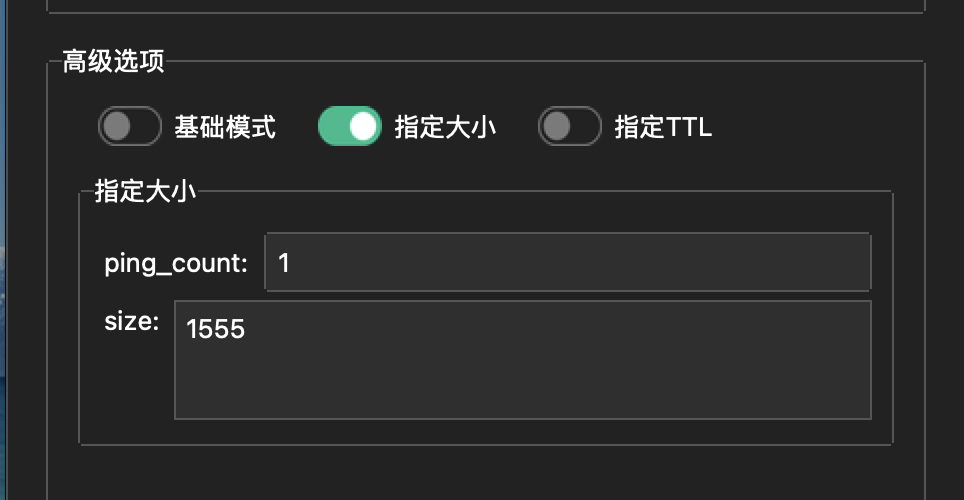
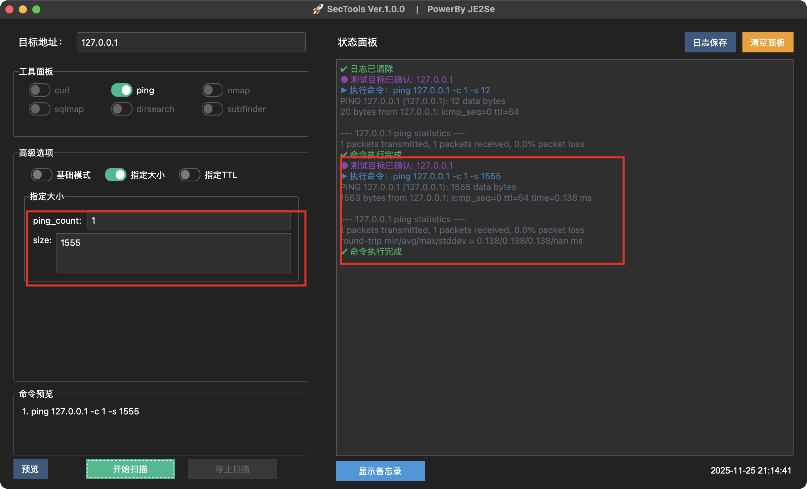
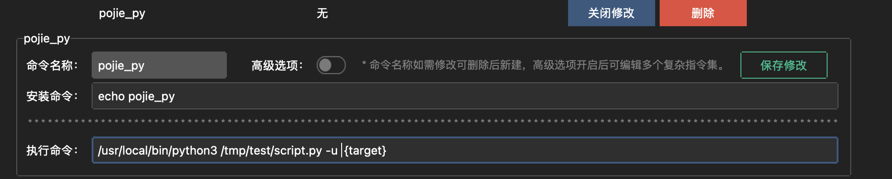
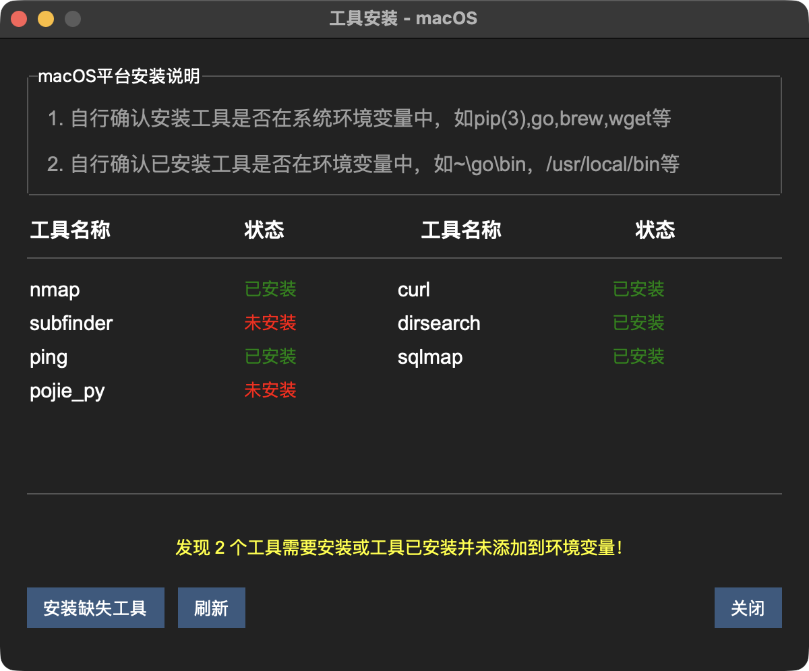

# 🚀 SecTools v1.0.0

一个基于Python和tkinter的安全工具集合，提供简洁的图形界面来执行常用的网络安全扫描工具，也可以将自身环境中的命令工具提供快捷指令以及图形化，主打的就是优雅的使用工具，做快乐的脚本小子。点个start 往下看！

##  💻 平台支持

支持m系列 MacOS，支持Intel系列MacOS，支持Windows全系列

## 🔧 使用说明

### 首次安装

第一步，在下载界面下载对应版本的程序安装；

第二步，安装后会在用户路径下生成一个SecToTools的缓存文件夹，也可以点击菜单栏操作->打开路径，可直接跳转到对应路径；

第三步，将下载界面的配置文件config.ini，以及tools.yaml 下载并拷贝到SecToTools文件夹里面。

(tools.yaml 是程序的工具配置文件，config.ini是程序的配置文件)

第三步就可以愉快的使用了。

#### 工具执行使用

第一步输入你要测试的目标，第二步选中你要用啥工具，第三步有高级选项的就按需填写，第四步看看自动预览的命令对不对，第五步点击开始，第六步看状态面板的实时输出

#### 小功能使用

备忘录记事本功能，在测试的时候难免会需要记录一些东西，我想做的就是把所有经历都放在当前的工具里面，点击下方显示备忘录，会加载出一个小记事本。可随时点击隐藏备忘录按钮避免遮挡，啥时候用，啥时候展开。当内容变化时，点击隐藏备忘录会有提醒确认保存，当然也可以勾选上自动保存按钮就可以随时优雅的关闭了。支持清空，手动保存，另存为，以及加载本地文件，这里说明一下，日志的源文件就在SecToTools文件夹中，加载可以加载txt文件，也可以加载md文件，支持部分格式渲染，只是部分哦！

状态面板就是实时的命令输入输出，支持保存，支持清空面板显示，就不解释了。

#### 主题

支持多个主题，都是TK默认自带的，大家自己研究吧，默认是黑色主题。

## 💥 核心模块-工具构建

打开菜单栏-工具-工具管理可到当前界面。当前界面为当前已拥有的工具列表，可添加删除修改工具

#### 添加工具

非常的简单，点击添加工具，把想要添加的命令添加进去，注意这里面就是完整的命令，注意区分命令大小写，你终端啥命令，这个就啥命令

#### 工具定义

这里面先简单说明一下。什么是一般工具，什么是开启高级选项的工具。一般工具我的定义为只有一条命令的那种，简简单工具就是我用到这个工具就只用一条命令，开启高级选项的工具就是这个命令有很多的参数，每个参数都代表着不同的功能，我想自定义配置很多的个性化功能。

| 一般工具                       | 高级选项工具                         |
| ------------------------------ | ------------------------------------ |
| 功能单一或者说用不到其他的命令 | 里面有很多的功能有很多的参数要自定义 |

#### 一般工具配置

新建工具后默认就是类似的界面，点击修改，添加工具的安装命令，如果已安装了就随便写，最好写个echo 这个样式的，这样工具安装界面会美化一些哦。然后在填写你要用到的命令，我举例curl，我想探测一下网站的存活，curl -s -l {target} 这里面target就是在主界面目标地址获取到的值，这个是固定参数哦，必填项。然后保存就好了。

主页用的时候就是这样了

#### 高级工具

高级工具可对同一个命令的配置多个功能，对不同指令集定义不同功能，添加方法也是很简单，勾选命令的高级选项，定义一个你对这个功能的命名，下面是执行的命令，高级工具可添加一般工具，就是一个参数的，也可以添加多个参数的，

比如ping {target} -c {ping_count} -s {size}，这里面我定义了多个参数，参数随便起名，但是一定要{}包裹，先输入功能命令，在勾选自定义参数，程序会自动识别的，你就可以添加参数默认值或者多行显示之类的

这里面多行显示的效果是这样的，主要是如果我需要填充一个很大的数据，显示会好看点，写几行，前端显示就几行

实际使用效果如下：

#### 其他高级用法

核心一点，只要你工具在环境变量里面，或者你知道绝对路径你就可以随便写

举例 python脚本,普通功能，

高级选项的，/usr/local/bin/python3 /tmp/test/script.py -u  {target} -f {suibian} 你只要知道路径，随便diy

### 工具安装界面

由于设计工具的时候填写了安装命令，这里面可一键安装,这里面需要注意的一件事，就是工具之类的需要安装路径需要在终端的环境变量里面，比如说我用的zsh。我所有的工具我在我的终端里面只要能输出能用，这里面就能用。至于你要用的其他环境变量，可自行设置中配置里面自行修改。

#### 工具更新

工具支持在线监测更新

### 其他

其他还有好多小巧思在里面，自行发觉吧。很多功能慢慢感受，有bug随时提，工具命令请根据自身环境修改，我给的只是demo，没核查命令，有错误的自行修改就好。也可以分享自己的tool.yaml  ,issus给我，我在新版本更新给大家用！

## 📄 许可证

本项目采用 MIT 许可证 - 查看 [LICENSE](LICENSE) 文件了解详情

## 🤝 贡献

工具灵感来源于bbtools，在巨人的肩膀上添砖加瓦！

欢迎提交 Issue 和 Pull Request！

## 📞 联系方式

- 作者: JE2Se
- 版本: v1.0.0

